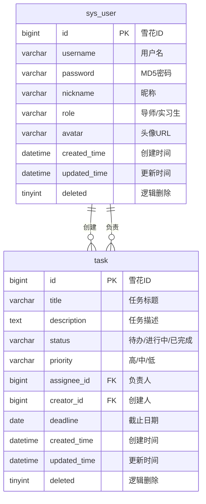
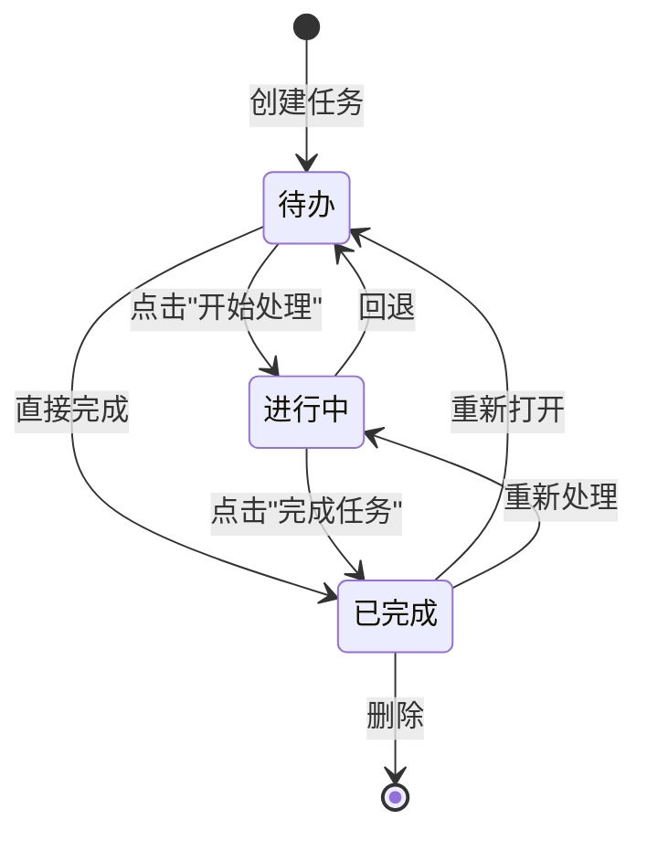
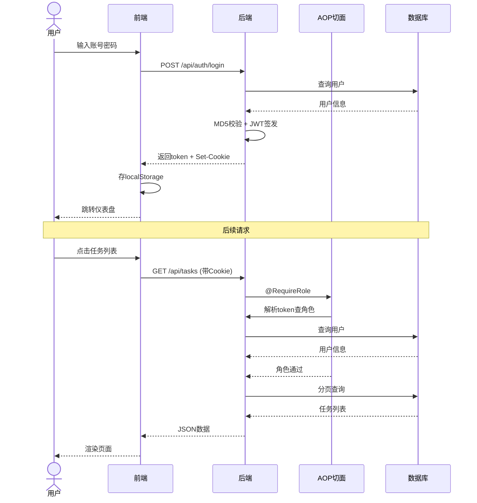

# 任务管理系统 - 设计文档

## 一、系统架构

```mermaid
graph TB
    subgraph 前端[前端 Vue 3]
        Login[登录页]
        TaskList[任务列表<br/>卡片/表格切换]
        Dashboard[个人仪表盘<br/>ECharts统计图]
        TaskDetail[任务详情<br/>+相关资讯]
        News[实时资讯<br/>+分页搜索]
    end

    subgraph 代理[Vite Dev Server]
        Proxy[Axios + Proxy]
    end

    subgraph 后端[后端 Spring Boot]
        Auth[认证模块<br/>JWT + MD5 + Cookie]
        Task[任务模块<br/>CRUD + 状态流转]
        NewsModule[资讯模块<br/>RSS多源抓取]
        AOP[AOP权限<br/>@RequireRole]
        Export[Excel导出<br/>EasyExcel]
    end

    subgraph 数据层[数据层]
        DB[(MySQL<br/>sys_user + task)]
        RSS[(外部RSS<br/>OSChina/36kr/掘金/CSDN)]
    end

    前端 -->|请求| 代理
    代理 -->|转发| 后端
    Auth --> DB
    Task --> DB
    NewsModule --> RSS
    AOP --> Auth
    Export --> DB
```

### 分层说明

| 层 | 技术 | 职责 |
|----|------|------|
| 前端展示层 | Vue 3 + Element Plus + ECharts | UI渲染、路由守卫、状态管理 |
| 代理层 | Vite Dev Server | 跨域代理转发 |
| 接口层 | RESTful API (JSON) | 前后端数据交换 |
| 控制层 | Spring Boot Controller | 接收请求、参数校验、响应返回 |
| 业务层 | Service + AOP | 业务逻辑、权限校验 |
| 持久层 | MyBatis-Plus | ORM映射、分页查询 |
| 数据层 | MySQL | 数据存储 |

### 分层说明

| 层 | 技术 | 职责 |
|----|------|------|
| 前端展示层 | Vue 3 + Element Plus + ECharts | UI渲染、路由守卫、状态管理 |
| 代理层 | Vite Dev Server | 跨域代理转发 |
| 接口层 | RESTful API (JSON) | 前后端数据交换 |
| 控制层 | Spring Boot Controller | 接收请求、参数校验、响应返回 |
| 业务层 | Service + AOP | 业务逻辑、权限校验 |
| 持久层 | MyBatis-Plus | ORM映射、分页查询 |
| 数据层 | MySQL | 数据存储 |

---

## 二、数据库表设计

### 2.1 ER 关系



### 2.2 用户表 `sys_user`

| 字段 | 类型 | 说明 |
|------|------|------|
| id | BIGINT (PK) | 雪花ID |
| username | VARCHAR(50) | 用户名（唯一） |
| password | VARCHAR(255) | MD5加密密码 |
| nickname | VARCHAR(50) | 昵称 |
| role | VARCHAR(20) | 角色：导师 / 实习生 |
| avatar | VARCHAR(255) | 头像URL |
| created_time | DATETIME | 创建时间 |
| updated_time | DATETIME | 更新时间 |
| deleted | TINYINT | 逻辑删除标记 |

### 2.3 任务表 `task`

| 字段 | 类型 | 说明 |
|------|------|------|
| id | BIGINT (PK) | 雪花ID |
| title | VARCHAR(200) | 任务标题 |
| description | TEXT | 任务描述 |
| status | VARCHAR(20) | 状态：待办 / 进行中 / 已完成 |
| priority | VARCHAR(10) | 优先级：高 / 中 / 低 |
| assignee_id | BIGINT (FK) | 负责人（关联sys_user） |
| creator_id | BIGINT (FK) | 创建人（关联sys_user） |
| deadline | DATE | 截止日期 |
| created_time | DATETIME | 创建时间 |
| updated_time | DATETIME | 更新时间 |
| deleted | TINYINT | 逻辑删除标记 |

---

## 三、任务状态流转



---

## 四、主要 API 接口设计

### 4.1 认证接口

| 方法 | 路径 | 说明 | 请求/响应 |
|------|------|------|-----------|
| POST | `/api/auth/login` | 用户登录 | `{username, password}` → `{token, user}` |
| POST | `/api/auth/register` | 用户注册 | `{username, password, nickname, role}` |
| GET | `/api/auth/me` | 当前用户信息 | → `{id, username, nickname, role}` |

### 4.2 任务接口

| 方法 | 路径 | 说明 | 角色 |
|------|------|------|------|
| GET | `/api/tasks` | 任务列表（支持分页/筛选） | 导师/实习生 |
| GET | `/api/tasks/{id}` | 任务详情 | 导师/实习生 |
| POST | `/api/tasks` | 创建任务 | 导师 |
| PUT | `/api/tasks/{id}` | 更新任务 | 导师 |
| DELETE | `/api/tasks/{id}` | 删除任务 | 导师 |
| PUT | `/api/tasks/{id}/status` | 更新状态 | 导师/实习生 |
| GET | `/api/tasks/statistics` | 任务统计数据 | 导师/实习生 |
| GET | `/api/tasks/export` | 导出Excel | 导师/实习生 |

### 4.3 资讯接口

| 方法 | 路径 | 说明 |
|------|------|------|
| GET | `/api/news` | 资讯列表（分页+搜索） |
| GET | `/api/news/refresh` | 手动刷新资讯缓存 |
| GET | `/api/news/search` | 实时搜索OSChina RSS（匹配） |
| GET | `/api/news/search-by-task` | 用任务标题搜索HackerNews/中文RSS |

### 4.4 筛选参数说明

| 参数 | 类型 | 说明 |
|------|------|------|
| status | String | 状态筛选 |
| assigneeId | Long | 负责人ID |
| creatorId | Long | 创建人ID |
| deadlineStart | LocalDate | 截止日期起始 |
| deadlineEnd | LocalDate | 截止日期结束 |
| keyword | String | 标题关键词 |
| page | int | 页码（默认1） |
| pageSize | int | 每页条数（默认20） |

### 4.5 统一响应格式

```json
{
  "code": 200,       // 0=成功, 40100=未登录, 40101=无权限
  "message": "success",
  "data": { ... }   // 具体数据
}
```

### 4.6 关键请求流程



---

## 五、技术选型理由

### 后端

| 技术 | 选型理由 |
|------|---------|
| **Spring Boot 3.2** | 最新稳定版，Java 21支持，启动快，生态成熟 |
| **MyBatis-Plus** | 比JPA更灵活，代码生成、分页插件、逻辑删除开箱即用 |
| **MySQL** | 关系型数据库，任务管理场景适合ACID事务 |
| **JWT (jjwt)** | 无状态认证，适合前后端分离，无需Session管理 |
| **EasyExcel** | 阿里开源的Excel工具，相比POI内存占用低90% |
| **Rome RSS** | Java标准的RSS解析库，支持多种Feed格式 |

### 前端

| 技术 | 选型理由 |
|------|---------|
| **Vue 3 + Composition API** | 组合式API更利于逻辑复用和类型推断 |
| **Vite** | 开发服务器秒级热更新，构建速度快 |
| **Element Plus** | Vue 3官方组件库，文档完善，组件丰富 |
| **ECharts + Vue-ECharts** | 开源图表库，性能好，可定制性强 |
| **Axios** | 基于Promise的HTTP客户端，拦截器机制 |

### 数据库设计

- 使用**雪花ID**而非自增ID，防止通过ID递增规律推断数据量
- 使用**逻辑删除**（deleted字段）防止误删数据
- 使用**外键索引**（assignee_id, creator_id）优化查询性能

---

## 六、AI工具使用心得

### 使用的AI工具

| AI工具 | 用途 |
|--------|------|
| **Claude (opencode)** | 主要开发助手，代码生成、重构、调试 |
| **GitHub Copilot** | 代码补全提示 |

### AI辅助的开发流程

1. **需求分析**: 读取 `.html` 需求文档，AI辅助拆解为可执行步骤
2. **代码生成**: 由AI先生成骨架代码，人工审查后再修改
3. **调试修复**: 遇到bug时，将错误日志给AI分析根因，提供修复方案
4. **代码重构**: AI辅助提取公共逻辑（如AOP切面、枚举校验等）

### AI生成代码的验证方法

| 验证方式 | 具体做法 |
|---------|---------|
| **编译验证** | AI生成代码后先 `mvn compile` / `npm run build` 检查编译 |
| **接口测试** | 通过 Knife4j 页面手动调用每个接口验证正确性 |
| **边界测试** | 测试空值、非法参数、越权访问等边界情况 |
| **日志追踪** | 添加 `System.out.println` 追踪执行路径定位问题 |

### 遇到的坑

| 问题 | 原因 | 解决 |
|------|------|------|
| Long精度丢失 | 雪花ID(19位)超JS Number精度(53位) | 后端Jackson配置Long→String序列化 |
| Cookie无法读取 | HttpOnly Cookie无法被JS访问 | 改用localStorage做登录状态判断 |
| HackerNews不可达 | 境外API被网络限制 | 改用国内可达的 RSS多源方案 |
| MyBatis-Plus分页不计数 | 缺少PaginationInnerInterceptor | 注册分页拦截器Bean |
| HTML特殊字符编译报错 | 模板中特殊字符导致Vue编译失败 | 改用HTML实体编码 |

### 具体问题截图

> (此处应插入截图 - 见项目目录 `screenshots/`)

1. **Long精度丢失**: 前端控制台显示ID被截断为1700000000000000000
2. **HackerNews超时**: 后端日志显示连接超时Exception
3. **分页total为0**: 任务列表底部显示"共0条"
4. **模板编译失败**: Vite错误"Element is missing end tag"

---

## 七、遇到的问题及解决思路

### 问题1: 雪花ID精度丢失

**现象**: 编辑任务时负责人ID自动变成1700000000000000000

**排查**: 前端控制台打印 `Number("1700000000000000001")` → `1700000000000000000`

**解决**: 
- 后端: `JacksonConfig` 配置 `Long` → `String` 序列化
- 前端: 所有ID字段改为String类型传输，取消 `el-input-number` 的Number转换

### 问题2: 登录后路由未能跳转

**现象**: 登录成功但页面停留在登录页

**排查**: 路由守卫使用 `document.cookie.includes('token=')` 检查，但token是HttpOnly的

**解决**: 路由守卫改用 `localStorage.getItem('logged_in')`，登录成功时写入localStorage

### 问题3: Knife4j无法发送Authorization头

**现象**: 测试接口时后端日志显示Authorization为null

**排查**: Knife4j的Authorize功能无法正确注入Bearer Token

**解决**: 改用Cookie认证 + AOP切面，浏览器自动管理Cookie

### 问题4: 任务详情页资讯搜索为空

**现象**: OSChina RSS有数据但不能匹配到任务标题

**排查**: 关键词"搭建Spring Boot项目骨架"在OSChina RSS 50条中没有匹配

**解决**: 提取英文关键词搜索HackerNews Algolia API，纯中文走多RSS源分词匹配

---

## 八、项目目录结构

```
taskManageSystem/
├── backend/                          # 后端 Spring Boot
│   ├── pom.xml
│   └── src/main/java/com/taskmanage/
│       ├── annotation/               # 自定义注解
│       │   └── RequireRole.java
│       ├── aspect/                   # AOP切面
│       │   └── RoleAspect.java
│       ├── common/                   # 公共类
│       │   ├── ErrorCode.java
│       │   ├── GlobalExceptionHandler.java
│       │   └── Result.java
│       ├── config/                   # 配置类
│       │   ├── JacksonConfig.java
│       │   ├── Knife4jConfig.java
│       │   ├── MyBatisPlusConfig.java
│       │   └── WebMvcConfig.java
│       ├── controller/               # 控制器
│       │   ├── AuthController.java
│       │   ├── NewsController.java
│       │   └── TaskController.java
│       ├── dto/                      # 数据传输对象
│       ├── entity/                   # 数据实体
│       ├── exception/                # 异常类
│       ├── mapper/                   # MyBatis Mapper
│       ├── model/                    # 模型（DTO/枚举）
│       ├── service/                  # 业务接口/实现
│       ├── util/                     # 工具类
│       └── validation/              # 自定义校验
├── frontend/                         # 前端 Vue 3
│   ├── package.json
│   ├── vite.config.js
│   └── src/
│       ├── App.vue
│       ├── main.js
│       ├── router/index.js
│       ├── utils/request.js
│       └── views/
│           ├── Login.vue
│           ├── Register.vue
│           ├── Dashboard.vue
│           ├── TaskList.vue
│           └── News.vue
├── 浙江汇信科技...笔试题0628.html     # 需求文档
├── result.txt                        # 调试日志
├── README.md                         # 本文件
└── 设计文档.md                        # 本文件
```
